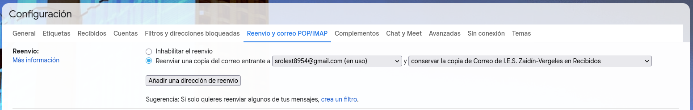
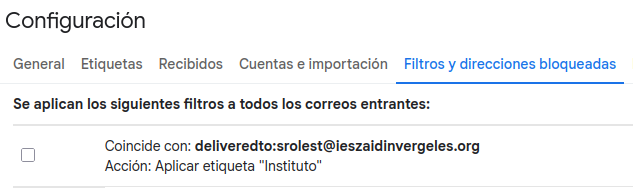
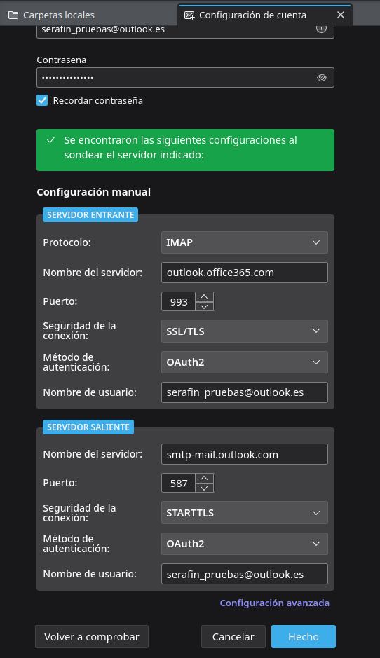
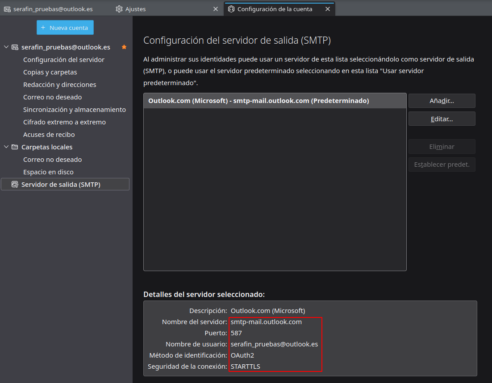
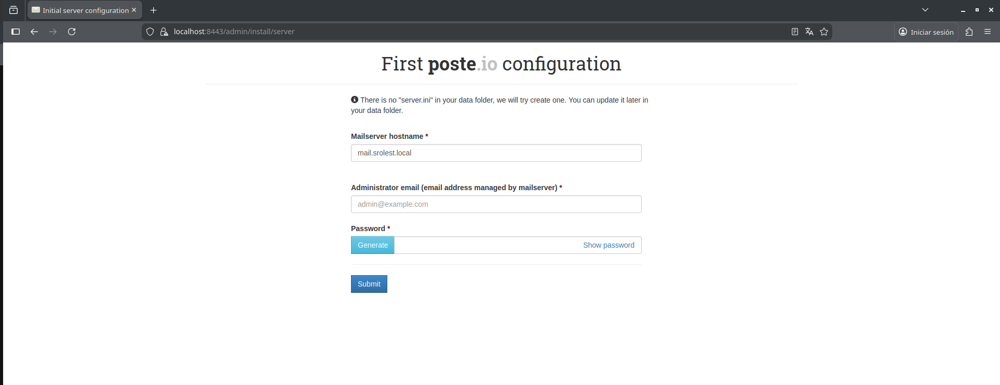
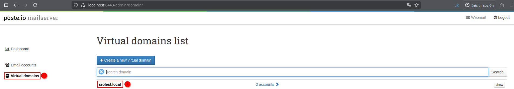
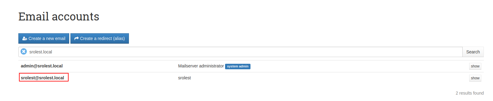
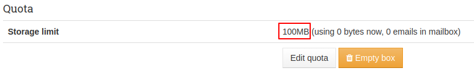
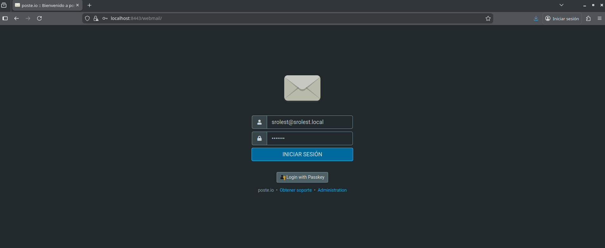

# 1. Redirección de correo y configuración cliente gráfico

## 1.1. Configuración de Redirección y Filtros
El objetivo es redirigir los correos corporativos a una cuenta personal de Gmail para mejorar la gestión de los mensajes.

**Pasos seguidos:**
1.  **Activación del Reenvío:** * Para ello accedemos a la configuración de la cuenta `@ieszaidinvergeles.org`.
    * En el apartado de "Reenvío y correo POP/IMAP", añadimos la dirección de Gmail personal como destino.
    * Debemos confirmas el código de verificación enviado por Google para validar la propiedad de la cuenta.
      

2.  **Creación del Filtro en Gmail:**
    * Dentro de Gmail, nos dirigimos a la barra de búsqueda avanzada para filtrar correos provenientes de `*@ieszaidinvergeles.org`.
    * Seleccionamos la opción **"Crear filtro"**.
    * Y marcamos: **"Aplicar la etiqueta: Instituto"** y **"Nunca enviar a Spam"** (si no tenemos la etiqueta instituto la creamos).
      

## 1.2. Configuración de Mozilla Thunderbird con Outlook
Para el uso del cliente de escritorio, tenemos que configurar una cuenta de `outlook.com`.

**Pasos seguidos para la conexión:**
1.  **Preparación de la cuenta de Microsoft:**
    * Debemos de crear si no la tenemos una cuenta de microsoft y en el apartado de reenvio aceptar pop e imap. 
2.  **Configuración en Thunderbird:**
    * Añadimos los servidores manualmente:
        * **Entrada (IMAP):** `outlook.office365.com` (Puerto 993, SSL/TLS).
        * **Salida (SMTP):** `smtp.office365.com` (Puerto 587, STARTTLS).
        
        

---

# Práctica 2 – Contenedor todo-en-uno Poste.io

## 1. Objetivo de la práctica

El objetivo de esta práctica es desplegar un servidor de correo **todo-en-uno** utilizando **Poste.io** en un contenedor Docker, que incluya los siguientes servicios:

* SMTP (envío de correo)
* POP3 e IMAP (recepción de correo)
* Antispam y antivirus
* Panel de administración web
* Cliente de correo web (Webmail)

Además, se deben cumplir los siguientes requisitos:

* Crear un usuario de correo con una **cuota de 100 MB**.
* Implementar **cifrado SSL/TLS** mediante un **certificado autofirmado**.
* Acceder a la cuenta creada usando el **webmail integrado** en Poste.io.

---

## 2. Lanzamiento del contenedor Poste.io

En primer lugar, se lanza el contenedor Docker utilizando la imagen oficial `analogic/poste.io`. Para ello, se ejecuta el siguiente comando:

```bash
docker run -d \
    -p 8080:80 \
    -p 8443:443 \
    -p 25:25 \
    -p 110:110 \
    -p 143:143 \
    -p 587:587 \
    -p 993:993 \
    -p 995:995 \
    -v /etc/localtime:/etc/localtime:ro \
    -v ./mail-data:/data \
    --name mailserver \
    -h mail.srolest.local \
    -t analogic/poste.io
```

### Explicación de los parámetros principales

* `-d`: ejecuta el contenedor en segundo plano.
* `-p`: mapea los puertos del host con los del contenedor:

  * `80 / 443`: administración web y webmail.
  * `25 / 587`: SMTP.
  * `110 / 995`: POP3 y POP3S.
  * `143 / 993`: IMAP e IMAPS.
* `-v ./mail-data:/data`: volumen para almacenar correos y configuración.
* `--name mailserver`: nombre del contenedor.
* `-h mail.srolest.local`: nombre de host del servidor de correo.

Con esto queda desplegado el servidor de correo completamente funcional.

---

## 3. Acceso al panel de administración

Al haber mapeado el puerto 443 del contenedor al puerto 8443 del host, se accede al panel web mediante la siguiente URL:

```
https://localhost:8443
```

### Certificado SSL autofirmado

Como Poste.io genera un **certificado SSL autofirmado**, el navegador muestra el aviso:

> "La conexión no es privada"

Para continuar:

1. Hacer clic en **Avanzado**.
2. Seleccionar **Aceptar el riesgo y continuar**.

Este comportamiento es normal en certificados autofirmados y cumple con el requisito de cifrado SSL/TLS del enunciado.

---

## 4. Configuración inicial del servidor

Una vez dentro del panel web:


* Se muestra el nombre del servidor configurado previamente:

  **mail.srolest.local**

* Se configura el usuario administrador:

  * Email de administración: `admin@srolest.local`
  * Contraseña: definida por el usuario

Tras completar este paso, se accede al panel principal de administración de Poste.io.

---

## 5. Creación del dominio virtual

En el menú lateral izquierdo:



1. Acceder a **Virtual Domains**.
2. Seleccionar el dominio **srolest.local** (creado automáticamente).

Este dominio será el utilizado para crear las cuentas de correo.

---

## 6. Creación de usuarios de correo

Para crear una nueva cuenta de correo:

1. Dentro del dominio `srolest.local`, pulsar en **Create new email**.
2. Crear el usuario `srolest@srolest.local`.
3. Asignar una contraseña al usuario.

### Asignación de cuota

* Una vez creado el usuario, volver a la lista de usuarios.



* Seleccionar el usuario creado.
* En el apartado de cuota configuramos una **cuota de 100 MB**.



Con esto, el usuario de correo queda correctamente configurado.

---

## 7. Acceso al cliente de correo web (Webmail)

Poste.io incorpora un cliente web de correo (Webmail), accesible desde la siguiente URL:

```
https://localhost:8443/webmail
```



Para acceder:

* Introducimos el correo creado `srolest@srolest.local`.
* Introducimos la contraseña correspondiente.


Tras iniciar sesión, se accede correctamente al **webmail**, verificando que:

* El servidor funciona correctamente.
* El usuario puede iniciar sesión.
* El acceso se realiza mediante conexión cifrada SSL/TLS.

---
